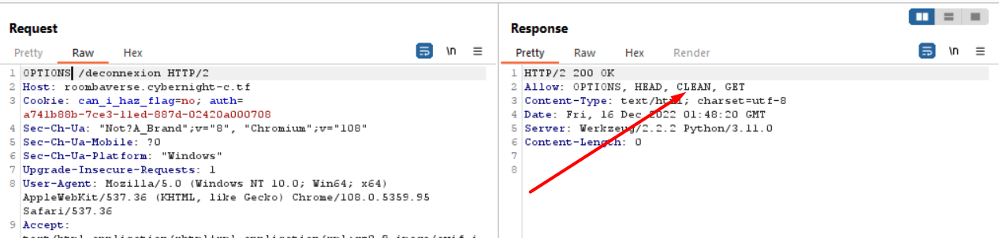
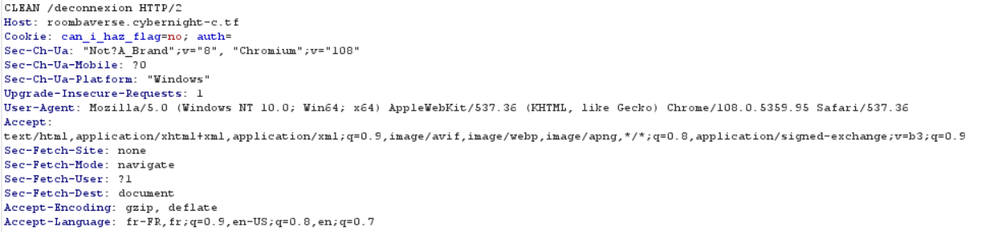
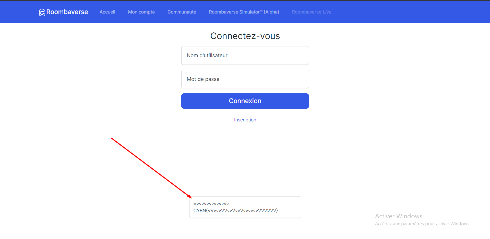

# WriteUp - **Roombaverse - vvvvvvvvvvvvvvvvvvvvvvvvvvvvvvvvvvvvv**

---

> **Titre du Challenge:** **Roombaverse - vvvvvvvvvvvvvvvvvvvvvvvvvvvvvvvvvvvvv**
> 
> 
> **Catégorie:** Web
> 
> **Difficulté :** Moyenne
> 
> **Points:** 50
> 
> **Auteur:** MrSheepSheep
> 
> **Description:** Vous avez essayé de vous déconnecter ?
> 

En lisant la description, on comprend qu’il est nécessaire de porter notre attention sur la page de déconnexion du site donné.

Au cours de notre analyse de cette page, nous sommes amenés à envoyer une requête “OPTIONS” sur la page de déconnexion afin de découvrir les méthodes possibles.

On remarque la présence d’une méthode peu commune “CLEAN”

Si l’on essaie d’envoyer une requête à cette page en utilisant cette méthode, cela provoque une réaction inattendue ; c’est l’objectif de ce challenge.

A la suite de cette requête, on récupère le flag dans la réponse. 

Flag : `CYBN{VVvvvVVvvVvvVvvvvvvVVVVVV}`